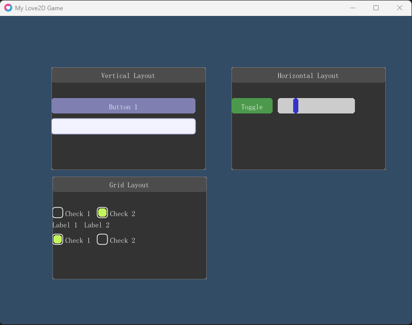

## 组件

- **Button**: 按钮组件，支持点击事件。
- **EditBox**: 文本输入框，支持文本输入和光标操作。
- **ToggleButton**: 切换按钮，支持开关状态。
- **Slider**: 滑块组件，支持拖动调整值。
- **Checkbox**: 复选框，支持选中状态。
- **Label**: 标签组件，用于显示文本。
- **ProgressBar**: 进度条，显示进度状态。

## 布局

- **FixedLayout**: 固定布局，组件位置固定。
- **VerticalLayout**: 垂直布局，组件垂直排列。
- **HorizontalLayout**: 水平布局，组件水平排列。
- **GridLayout**: 网格布局，组件按网格排列。

## 界面展示

## 贡献

欢迎贡献代码！请提交 Pull Request 或报告问题。

## 许可证

此项目使用 MIT 许可证。详情请参阅 LICENSE 文件。